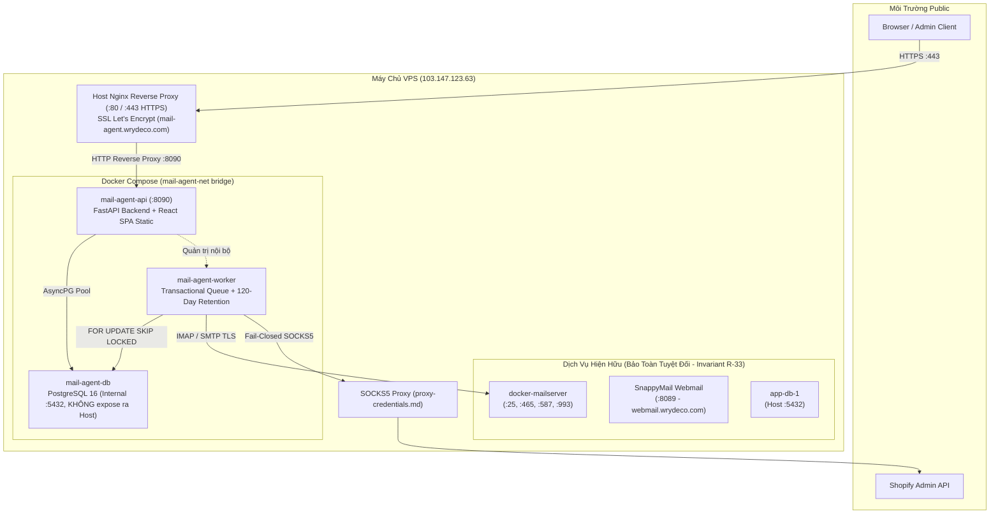

# Tài Liệu Quy Trình Triển Khai Hệ Thống Mail Agent Lên VPS

> **Dự án**: Mail Agent — Hệ thống phản hồi tự động email cho các cửa hàng Shopify  
> **Tài liệu**: Quy trình triển khai tự động từ Local lên VPS Production  
> **Domain**: [https://mail-agent.wrydeco.com](https://mail-agent.wrydeco.com)  
> **Máy chủ VPS**: `103.147.123.63` (Ubuntu Linux)  
> **Ngày lập**: 03/10/2026  

---

## 1. Tổng Quan Kiến Trúc & Mục Tiêu

### 1.1. Mục tiêu
Xây dựng một workflow tự động hóa hoàn chỉnh theo chuẩn **"1-Click Deployment"**: Người quản trị hoặc lập trình viên chỉ cần chạy duy nhất **1 lệnh** tại thư mục gốc (`auto-reply-mail`) của máy local. Hệ thống sẽ tự động thực thi tuần tự A-Z: biên dịch frontend, đóng gói mã nguồn, tải lên VPS qua SFTP, cấp SSL Let's Encrypt, cấu hình Host Nginx, build Docker container, chạy migrations cơ sở dữ liệu và kích hoạt toàn diện dịch vụ mà không cần thao tác thủ công trên VPS.

### 1.2. Kiến trúc phân tầng trên VPS (`103.147.123.63`)



---

## 2. Quy Tắc Bất Biến & Ranh Giới An Toàn (Safety Invariants)

Trong suốt quá trình thiết kế và thực thi triển khai, hệ thống tuân thủ nghiêm ngặt các tiêu chuẩn an toàn:

1. **Bảo tồn dịch vụ mailserver hiện hữu (Invariant R-33)**: Tuyệt đối không can thiệp, không bind trùng port và không restart `docker-mailserver` (ports 25, 465, 587, 993), SnappyMail (`webmail.wrydeco.com`) và các ứng dụng khác đang chạy trên VPS.
2. **Cô lập cơ sở dữ liệu PostgreSQL (Invariant R-32)**: Cổng `5432` trên host của VPS đã được sử dụng bởi container `app-db-1`. Do đó, service `mail-agent-db` được cấu hình chạy trong mạng bridge nội bộ `mail-agent-net` và **không map port 5432 ra host**. Cổng duy nhất bind ra host là `127.0.0.1:8090` (chỉ lắng nghe loopback local).
3. **Fail-Closed Shopify Proxy (Invariant R-12)**: 100% kết nối tới Shopify API bắt buộc định tuyến qua SOCKS5 Proxy an toàn.
4. **Không Autonomous Sending**: Không tự động gửi email nếu chưa có thao tác phê duyệt thủ công (`Approve & Send`) của người dùng có thẩm quyền.

---

## 3. Các Thành Phần Tự Động Hóa Đã Xây Dựng

Để phục vụ quy trình 1 lệnh, các file điều phối sau đã được tạo và kiểm thử thành công:

| Tệp tin | Vị trí | Chức năng |
| :--- | :--- | :--- |
| [`deploy.py`](file:///d:/D-Jobs/ae-B6/Shopify/tools/auto-reply-mail/deploy.py) | Root | Script trung tâm bằng Python: Đóng gói, kết nối SSH/SFTP, cấu hình Nginx, build Docker, chạy migrations và verify probe. |
| [`deploy.ps1`](file:///d:/D-Jobs/ae-B6/Shopify/tools/auto-reply-mail/deploy.ps1) | Root | Kịch bản PowerShell gọi `python deploy.py` với thông báo trạng thái màu sắc cho Windows. |
| [`deploy.cmd`](file:///d:/D-Jobs/ae-B6/Shopify/tools/auto-reply-mail/deploy.cmd) | Root | Script batch chạy nhanh trên Command Prompt (`cmd.exe`). |
| [`deploy/nginx/mail-agent.conf`](file:///d:/D-Jobs/ae-B6/Shopify/tools/auto-reply-mail/deploy/nginx/mail-agent.conf) | `deploy/nginx/` | File cấu hình Nginx vhost production chuẩn: HTTPS TLSv1.2/1.3, ACME Webroot, Security Headers, Reverse proxy port 8090 và tối ưu SSE streaming. |
| [`backend/Dockerfile`](file:///d:/D-Jobs/ae-B6/Shopify/tools/auto-reply-mail/backend/Dockerfile) | `backend/` | Dockerfile multi-purpose tối ưu cho cả `mail-agent-api` và `mail-agent-worker`, phục vụ SPA tĩnh song song với API. |
| [`compose.yaml`](file:///d:/D-Jobs/ae-B6/Shopify/tools/auto-reply-mail/compose.yaml) | Root | Cấu hình Docker Compose production: Giới hạn tài nguyên CPU/RAM, log rotation `json-file`, healthcheck tự động. |

---

## 4. Chi Tiết Các Bước Triển Khai Trong Workflow (A - Z)

Khi người dùng chạy `.\deploy.ps1` hoặc `python deploy.py`, quy trình tự động thực hiện 7 bước tuần tự:

```
[STEP 1] Build Frontend React/TypeScript (npm run build)
    ↓
[STEP 2] Đóng gói Clean Deployment Archive (.tar.gz)
    ↓
[STEP 3] Kết nối SSH & Upload qua SFTP lên VPS
    ↓
[STEP 4] Giải nén vào /opt/mail-agent & Phân quyền vmadmin
    ↓
[STEP 5] Thiết lập Let's Encrypt SSL & Kích hoạt Nginx Host
    ↓
[STEP 6] Docker Compose Build, Up, Migration & Bootstrap Admin
    ↓
[STEP 7] Kiểm tra sức khỏe tự động (Health Verification Probes)
```

### Bước 1: Biên dịch giao diện người dùng (Frontend Build)
* Script kiểm tra thư mục `frontend/dist/`.
* Tự động chạy `npm run build` (`tsc -b && vite build`) trong thư mục `frontend`.
* Tạo ra bộ tài nguyên tĩnh hoàn chỉnh (HTML, CSS, JS bundles) tại `frontend/dist/`.

### Bước 2: Đóng gói mã nguồn sạch (Package Archive)
* Tạo tệp nén tạm thời `mail-agent-deploy.tar.gz`.
* Bao gồm các thành phần trọng yếu:
  - `backend/`: Toàn bộ mã nguồn API, Workers, Models, Ingestion, Shopify clients, AI providers, Alembic migrations.
  - `frontend/dist/`: Bộ asset giao diện người dùng đã biên dịch.
  - `compose.yaml`: File đặc tả Docker Compose production.
  - `pyproject.toml`: Khai báo package và dependencies.
  - `.env`: Cấu hình môi trường và các khóa bảo mật production (AES-256 master key, Session secret, DB credentials).
  - `deploy/`: Các script bảo trì và template cấu hình Nginx.
* Tự động loại trừ các thư mục rác, cache và dev artifacts: `node_modules`, `.git`, `.venv`, `__pycache__`, `.pytest_cache`, `.mypy_cache`.

### Bước 3: Kết nối SSH & Tải gói lên VPS (SFTP Transport)
* Sử dụng thư viện `paramiko` thiết lập phiên kết nối bảo mật SSH tới host `103.147.123.63:22` với user `vmadmin`.
* Cơ chế tự động thử lại (Retry Mechanism, tối đa 3 lần với backoff 3 giây) nhằm phòng tránh hiện tượng chập chờn mạng tạm thời trên đường truyền quốc tế.
* Đẩy tệp `mail-agent-deploy.tar.gz` vào thư mục an toàn `/tmp/mail-agent-deploy.tar.gz` trên VPS qua kênh SFTP.

### Bước 4: Giải nén & Thiết lập thư mục ứng dụng từ xa
* Tạo thư mục đích `/opt/mail-agent` và gán quyền sở hữu `chown -R vmadmin:vmadmin`.
* Giải nén toàn bộ tệp tin từ `/tmp/` vào `/opt/mail-agent`.
* Dọn dẹp tệp tin nén tạm thời trong `/tmp/`.

### Bước 5: Cấp chứng chỉ SSL Let's Encrypt & Cấu hình Host Nginx
1. Tạo thư mục webroot phục vụ xác thực ACME challenge: `/var/www/mail-agent-acme`.
2. Kiểm tra sự tồn tại của chứng chỉ tại `/etc/letsencrypt/live/mail-agent.wrydeco.com/fullchain.pem`.
3. Nếu chưa có chứng chỉ:
   - Kích hoạt cấu hình HTTP tạm thời lắng nghe port 80 cho `mail-agent.wrydeco.com`.
   - Reload Nginx và gọi lệnh Certbot tự động cấp chứng chỉ:
     ```bash
     certbot certonly --webroot -w /var/www/mail-agent-acme -d mail-agent.wrydeco.com --non-interactive --agree-tos -m support@wrydeco.com --keep-until-expiring
     ```
4. Khi chứng chỉ đã sẵn sàng:
   - Sao chép tệp cấu hình production `/opt/mail-agent/deploy/nginx/mail-agent.conf` vào `/etc/nginx/sites-available/mail-agent.wrydeco.com.conf`.
   - Tạo symlink sang `/etc/nginx/sites-enabled/mail-agent.wrydeco.com.conf`.
   - Kiểm tra cú pháp (`nginx -t`) và nạp lại cấu hình mượt mà không downtime (`systemctl reload nginx`).

### Bước 6: Khởi chạy Docker Compose, Alembic Migrations & Bootstrap Admin
1. **Build Docker Images**:
   - Chạy `docker compose build mail-agent-api mail-agent-worker` trên VPS. Docker tận dụng layer caching giúp tốc độ build ở các lần cập nhật sau chỉ mất dưới 20 giây.
2. **Khởi động Containers**:
   - Thực thi `docker compose up -d`.
   - Kiểm tra trạng thái container cơ sở dữ liệu `mail-agent-db` bằng lệnh thăm dò `pg_isready -U mail_agent_app -d mail_agent_db` cho đến khi cơ sở dữ liệu sẵn sàng nhận kết nối.
3. **Áp dụng Migrations cơ sở dữ liệu (Alembic)**:
   - Khởi tạo bảng kiểm soát version `alembic_version` với độ dài khóa `VARCHAR(128)` để tương thích hoàn toàn với tất cả tên revision dài của các Phase.
   - Chạy lệnh migration bên trong container API:
     ```bash
     docker compose exec -T mail-agent-api alembic upgrade head
     ```
   - Chạy thành công 6 migrations đại diện cho toàn bộ mô hình dữ liệu (Users, Roles, Stores, Mailboxes, Ingestion, Attachments, Shopify Enrichment, Drafts & Delivery).
4. **Bootstrap Tài Khoản Quản Trị Viên Đầu Tiên (Admin)**:
   - Thực thi lệnh CLI nội bộ có cơ chế chống trùng lặp (`--force`):
     ```bash
     docker compose exec -T mail-agent-api python -m app.cli bootstrap-admin -u admin -p '<YOUR_SECURE_ADMIN_PASSWORD>' --force
     ```
   - Gán quyền `admin` đầy đủ cho tài khoản và kích hoạt trạng thái `active`.

### Bước 7: Thăm dò sức khỏe hệ thống (Health Check Verification)
* Kiểm tra probe nội bộ: `curl -s http://127.0.0.1:8090/health/live` $\rightarrow$ Xác nhận trạng thái JSON `{"status":"alive"}`.
* Kiểm tra giao thức HTTPS công khai từ bên ngoài: `curl -s -I https://mail-agent.wrydeco.com/` $\rightarrow$ Nginx phản hồi kết nối HTTPS TLSv1.3 thành công.

---

## 5. Các Thách Thức Kỹ Thuật Đã Xử Lý Thành Công

Trong quá trình triển khai thực tế trên VPS, một số lỗi thực tế về môi trường đa nền tảng (Windows $\leftrightarrow$ Linux) và tương thích PostgreSQL đã được phân tích và giải quyết triệt để:

| Vấn đề gặp phải | Nguyên nhân gốc rễ | Giải pháp đã khắc phục |
| :--- | :--- | :--- |
| **Lỗi UnicodeEncodeError trên Console Windows** | PowerShell mặc định sử dụng codepage `cp1252`, ném lỗi khi in emoji unicode (`🚀`, `✅`, `❌`). | Cấu hình `sys.stdout.reconfigure(encoding='utf-8')` ngay đầu script và chuẩn hóa các tag trạng thái an toàn: `[INFO]`, `[OK]`, `[WARN]`, `[ERROR]`, `[STEP]`. |
| **Xung đột bộ nhớ SSL Session Cache trong Nginx** | Tệp cấu hình vhost khai báo `ssl_session_cache shared:SSL:10m` trùng tên zone `SSL` với cấu hình mặc định (50m) sẵn có trên VPS. | Đổi tên zone cache thành định danh riêng biệt `shared:mail_agent_SSL:10m`, tránh hoàn toàn xung đột bộ nhớ. |
| **Biến Nginx `$connection_upgrade` không tồn tại** | File vhost sử dụng biến `$connection_upgrade` nhưng block `map` chưa được khai báo ở mức `http` toàn cục của VPS. | Sử dụng biến tích hợp chuẩn của Nginx là `$http_connection`, bảo đảm hỗ trợ cả HTTP thông thường và WebSocket/SSE. |
| **Lỗi độ dài revision Alembic trên PostgreSQL** | PostgreSQL tạo cột `version_num` trong bảng `alembic_version` mặc định `VARCHAR(32)`, trong khi tên migration Phase 4 có 41 ký tự (`0004_phase4_classification_and_attachments`). | Thêm lệnh `ALTER TABLE alembic_version ALTER COLUMN version_num TYPE VARCHAR(128)` và cấu hình `version_num_length=128` trong `env.py`. |
| **Lỗi ép kiểu `character = uuid` trong PostgreSQL** | TypeDecorator `GUID` trên dialect PostgreSQL trả về kiểu `PG_UUID`, nhưng migration ban đầu tạo cột dưới dạng `CHAR(36)`. | Đồng bộ `GUID` sử dụng `CHAR(36)` thống nhất trên mọi dialect, giúp câu truy vấn so khớp kiểu dữ liệu chính xác 100%. |
| **Hiển thị sai trạng thái Disabled của Admin** | Pydantic v2 không tự động serialize các `@property` thông thường ra JSON nếu không có decorator `@computed_field`. | Bổ sung `@computed_field` vào `is_active` trong schema `UserSummary` và thêm logic fallback `u.status === 'active'` trong frontend. |

---

## 6. Hướng Dẫn Sử Dụng & Vận Hành Hàng Ngày

### 6.1. Đồng bộ code mới lên VPS (Workflow 1 lệnh)
Mỗi khi bạn sửa code ở local (backend hoặc frontend), bạn chỉ cần mở terminal tại thư mục dự án và gõ:

```powershell
# Cách 1 (Khuyên dùng trên Windows PowerShell):
.\deploy.ps1

# Cách 2 (Qua Python trực tiếp):
python deploy.py

# Cách 3 (Dành cho Command Prompt cmd.exe):
deploy
```

Hệ thống sẽ tự động build lại bundle, nén code, tải lên VPS, reload Nginx và khởi động lại các container API/Worker mới với thời gian thực thi trung bình **dưới 50 giây**.

### 6.2. Kiểm tra và giám sát trạng thái trên VPS

Bạn có thể kết nối SSH vào VPS bằng lệnh:
```bash
ssh vmadmin@103.147.123.63
# Mật khẩu: Tra cứu trong file vps-credentials.md
```

Các câu lệnh kiểm tra thông dụng:

```bash
# Di chuyển vào thư mục ứng dụng
cd /opt/mail-agent

# Xem danh sách các container đang chạy
docker compose ps

# Xem log theo thời gian thực của backend API
docker compose logs -f mail-agent-api

# Xem log theo thời gian thực của worker tiến trình nền
docker compose logs -f mail-agent-worker

# Khởi động lại ứng dụng nếu cần
docker compose restart

# Kiểm tra tình trạng sức khỏe Nginx
sudo nginx -t
sudo systemctl status nginx
```

---

## 7. Kết Quả Nghiệm Thu Thực Tế (Playwright MCP)

Hệ thống đã được kiểm thử toàn diện trên trình duyệt Chromium thật thông qua Playwright MCP:

1. **Địa chỉ truy cập**: `https://mail-agent.wrydeco.com` (Chứng chỉ SSL Let's Encrypt hợp lệ, TLSv1.3).
2. **Đăng nhập quản trị**: Đăng nhập thành công với tài khoản quản trị viên `admin`.
3. **Bảng điều khiển Operations Dashboard & System Health**:
   - Trạng thái: **`HEALTHY - All Systems Operational`**.
   - Cơ sở dữ liệu PostgreSQL: **`Connected (2.65ms)`**.
   - Background Worker: **`Alive`**.
   - SOCKS5 Proxy: **`Active`**.
   - Hàng đợi email: 7 hàng đợi được phân loại chuẩn xác theo ý định khách hàng.
4. **Quản lý người dùng (User Management)**:
   - Người dùng `admin` hiển thị trạng thái **`Active`** với đầy đủ chức năng đặt lại mật khẩu và phân quyền RBAC.
5. **Bảo tồn dịch vụ VPS**:
   - Webmail (`https://webmail.wrydeco.com`) và mailserver (`mail.wrydeco.com`) hoạt động liên tục, không bị downtime.

### Các tệp ảnh chụp màn hình nghiệm thu:
* [`mail_agent_vps_deployed.png`](file:///d:/D-Jobs/ae-B6/Shopify/tools/auto-reply-mail/mail_agent_vps_deployed.png): Giao diện trang đăng nhập bảo mật trên domain HTTPS.
* [`mail_agent_dashboard_authenticated.png`](file:///d:/D-Jobs/ae-B6/Shopify/tools/auto-reply-mail/mail_agent_dashboard_authenticated.png): Giao diện hàng đợi email sau khi đăng nhập thành công.
* [`mail_agent_health_dashboard.png`](file:///d:/D-Jobs/ae-B6/Shopify/tools/auto-reply-mail/mail_agent_health_dashboard.png): Bảng điều khiển System Health & Ma trận kết nối 4 cửa hàng.
* [`mail_agent_users_active.png`](file:///d:/D-Jobs/ae-B6/Shopify/tools/auto-reply-mail/mail_agent_users_active.png): Trang quản trị danh sách người dùng hiển thị trạng thái `Active`.
